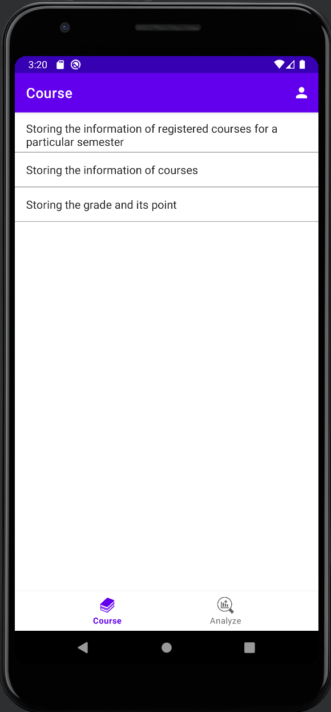

# CGPA-CALCULATOR_APP
The CGPA Mobile App is a user-friendly and intuitive application designed to assist students in tracking and managing their academic performance. With its comprehensive features and sleek interface, the app provides a convenient way for students to calculate and monitor their Cumulative Grade Point Average (CGPA) effortlessly.

Key Features:

Grade Calculation: The app allows students to input their course grades along with the respective credit hours. It automatically calculates the CGPA based on the entered information, saving students the hassle of manual calculations.

Semester-wise Tracking: Students can organize their courses by semester, enabling them to track their performance on a term-by-term basis. The app displays a summary of each semester's GPA and CGPA, providing a clear overview of academic progress.

Course Management: The CGPA Mobile App offers a course management feature that enables students to add, edit, and delete courses easily. They can input the course name, credit hours, and grade to keep their records up to date.

Predictive CGPA: The app provides a predictive CGPA feature that allows students to explore the potential outcomes of their grades. By adjusting the grades of ongoing or future courses, students can estimate the impact on their overall CGPA.

Goal Setting: Students can set academic goals using the app, specifying a target CGPA they wish to achieve. The app helps them stay motivated by displaying progress towards their goal and providing insights on the grades required to reach it.

Progress Visualization: The CGPA Mobile App offers graphical representations of academic progress, including line charts and bar graphs. These visualizations provide a quick overview of semester-wise performance and trends over time.

Reminders and Notifications: The app supports reminders and notifications, ensuring students stay on track with assignment due dates, exam schedules, and registration deadlines. This feature helps students manage their time effectively and stay organized.

Secure Data Storage: The app prioritizes data security and confidentiality. Student records and grades are securely stored on the device, and the app offers password protection or biometric authentication to prevent unauthorized access.

Screenshots:

Home Screen: The home screen of the CGPA Mobile App displays the current semester's CGPA and GPA, along with a summary of the overall CGPA. It provides quick access to other features such as grade calculation, course management, and goal setting.

Grade Calculation: This screen allows students to input their course grades and credit hours, and it automatically calculates the CGPA based on the entered information. The screen may also display the predictive CGPA based on the current grades and allow adjustments to see potential outcomes.
[Insert screenshot of the grade calculation screen here]

Semester Overview: This screen provides a comprehensive overview of each semester's GPA and CGPA. It displays a list of courses taken in the semester, their grades, and credit hours. Students can navigate through different semesters to track their progress.
[Insert screenshot of the semester overview screen here]

Course Management: The course management screen allows students to add, edit, and delete courses. They can input the course name, credit hours, and grade. The screen may also provide an option to view detailed information about each course.
[Insert screenshot of the course management screen here]
